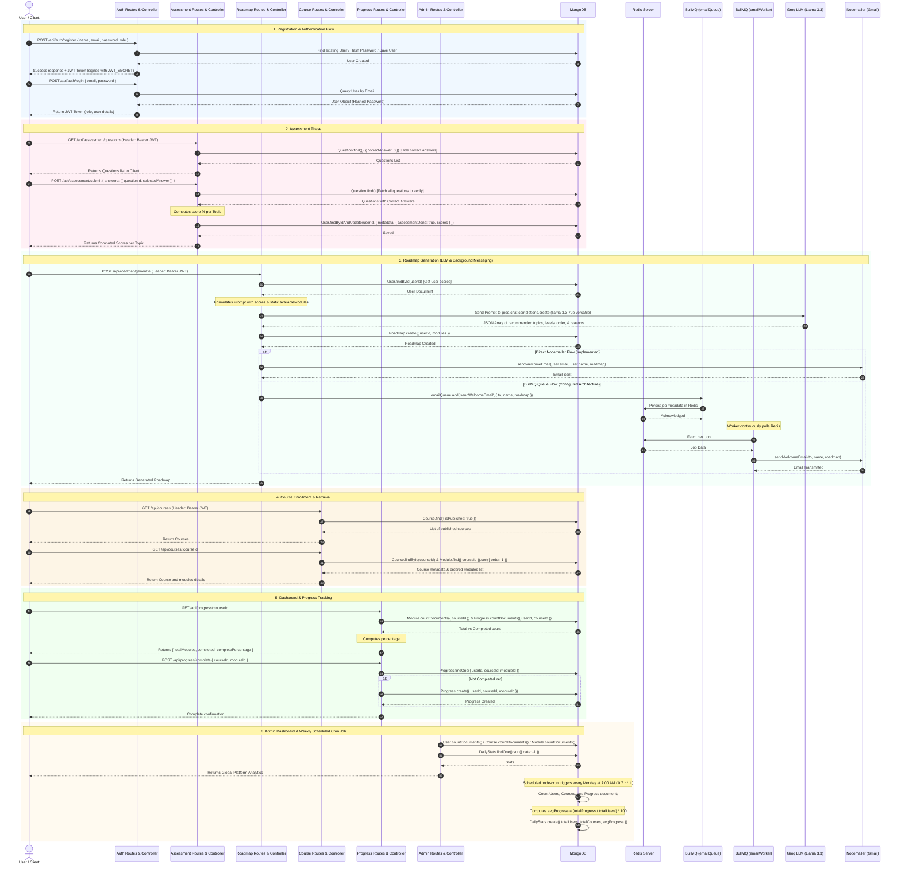
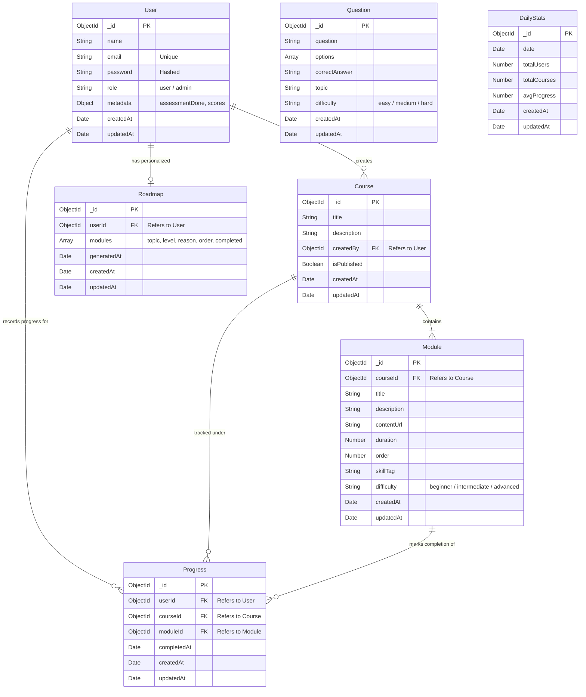

# B2B Learning Platform - Backend Flow & Relationship Documentation

This document provides a detailed architectural breakdown of the B2B Learning Platform backend (located in the `/backend` folder). It covers the complete request-response flow from User Login to the Dashboard, the background processing pipelines (BullMQ, Redis, Cron, and Mailer), and the Database Entity-Relationship (ER) model.

---

## 1. Complete End-to-End User Flow

The diagram below details the step-by-step workflow of a user navigating the platform, showing how HTTP routes, controllers, Mongoose models, external APIs (Groq LLM), Redis/BullMQ queues, and Nodemailer integrate.

---

## 2. Database Schema & Relationships (ERD)

The databases are connected through document-oriented references (`mongoose.Schema.Types.ObjectId`). The Entity-Relationship Diagram below displays exactly how the database collections link together.

### Relationship Details:
1. **User ↔ Course**: A 1-to-many relationship (`createdBy` links to `User`). This signifies which administrator created the course.
2. **Course ↔ Module**: A 1-to-many relationship. The `Module` schema references `Course` via `courseId`. A course contains multiple learning modules sorted sequentially.
3. **User ↔ Progress**: A 1-to-many relationship. The `Progress` collection links `userId`, `courseId`, and `moduleId` to track exactly which user completed what module.
4. **User ↔ Roadmap**: A 1-to-1 relationship mapping user skill assessments to an LLM-tailored learning plan.
5. **Question & DailyStats**:
   - `Question` represents assessment pool components and has no direct DB keys linking to other models. Instead, questions are matched logically in memory via their `topic` attribute.
   - `DailyStats` records snapshots of global usage analytics generated on a scheduler.

---

## 3. Background Processing Integration Detail
The system utilizes a modern asynchronous stack for mail delivery:
* **Redis (`ioredis`)**: Instantiated via [connection.js](file:///d:/B2B-Learning%20Platform/backend/queues/connection.js). Serves as the storage and message broker backend.
* **BullMQ (`Queue` & `Worker`)**: 
  - [emailQueue.js](file:///d:/B2B-Learning%20Platform/backend/queues/emailQueue.js) creates an entrypoint named `emailQueue`.
  - [emailWorker.js](file:///d:/B2B-Learning%20Platform/backend/queues/emailWorker.js) processes jobs of type `sendWelcomeEmail` by polling Redis.
* **Nodemailer**: Connects via Gmail SMTP configured in [mailer.js](file:///d:/B2B-Learning%20Platform/backend/utils/mailer.js) to compile and send template emails containing the dynamic user roadmap.
